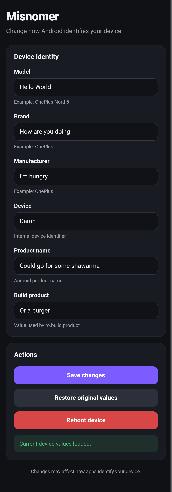
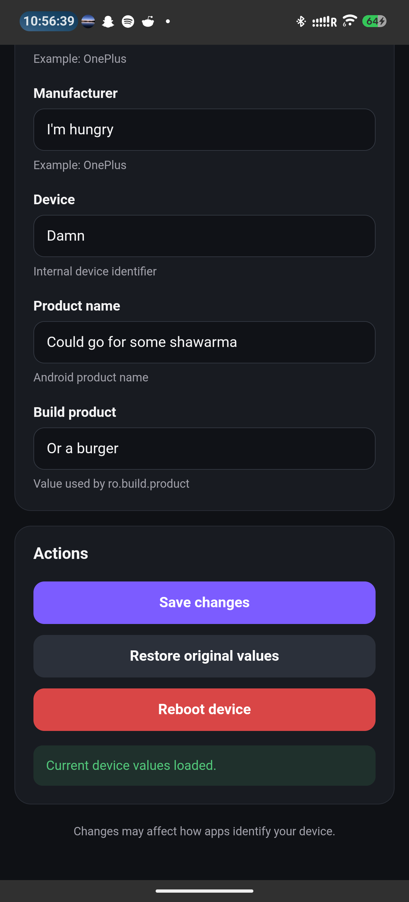

<p align="center">
  
</p>

<h1 align="center">Misnomer</h1>

<p align="center">
  <b>Gaslight Android.</b>
</p>

<p align="center">
  A lightweight root module for changing the device identity properties reported by Android through a simple WebUI.
</p>

<p align="center">
  
  
  
  
</p>

---

## About

**Misnomer** allows you to change the identity properties reported by your Android device without manually messing around with system property files.

It provides a simple WebUI where you can view your device's current identity, change the values you want, save them, and apply the changes after a reboot.

**Misnomer** currently allows you to change:

- Model
- Brand
- Manufacturer
- Device
- Name
- Product

The configured properties are applied systemlessly during boot.

---

## Features

- Simple and lightweight WebUI
- View your device's current identity properties
- Change individual identity properties
- Systemless property modification
- Persistent configuration across reboots
- Restore original device values
- Reboot directly from the WebUI
- Atomic configuration saving to reduce the risk of corrupted settings
- Native WebUI support on **KernelSU** and compatible managers
- Potential **Magisk** support through **KsuWebUI**

---

## Screenshots

<p align="center">
  
  &nbsp;&nbsp;
  
</p>

---

## Compatibility

### **KernelSU** / **KernelSU Next**

**Misnomer** is designed primarily for **KernelSU** and **KernelSU Next**.

Install the module, reboot your device, and open **Misnomer** using the **WebUI** button in your root manager.

### **Magisk**

The backend of **Misnomer** uses standard Android root module components including:

- `module.prop`
- `customize.sh`
- `post-fs-data.sh`
- `resetprop`

The official **Magisk** app does not natively provide **KernelSU**-style module WebUIs.

Magisk users can potentially access the **Misnomer** WebUI using [**KsuWebUI**](https://github.com/adivenxnataly/KsuWebUI).

**KsuWebUI** provides a way to open compatible **KernelSU**-style module WebUIs when using **Magisk**.

**Magisk support is currently considered experimental until Misnomer has been properly tested on a Magisk-rooted device.**

---

## Installation

### **KernelSU** / **KernelSU Next**

1. Download the latest `Misnomer` ZIP from the GitHub Releases page.
2. Open **KernelSU** Manager app.
3. Go to **Modules**.
4. Install the **Misnomer** ZIP.
5. Reboot your device.
6. Open **Misnomer** using the **WebUI** button.

### **Magisk**

> Magisk support is currently experimental.

1. Install **KsuWebUI** if you want to use the graphical **Misnomer** interface.
2. Download the latest **Misnomer** ZIP.
3. Open **Magisk**.
4. Install the **Misnomer** ZIP.
5. Reboot your device.
6. Open **Misnomer** using the **Open with KsuWebUI** option provided by **KsuWebUI**.

---

## Usage

Open the **Misnomer** WebUI.

Your device's currently reported identity properties will automatically fill the available fields.

Change whichever properties you want Android to report.

For example:

```text
Model: OnePlus Nord 5
Brand: OnePlus
Manufacturer: OnePlus
Device: your_device
Name: your_product_name
Product: your_build_product
```

Press **Save changes** when you're finished.

Reboot your device for the configured properties to be applied fully.

---

## Restoring Original Values

**Misnomer** does not permanently modify the original property files stored in your Android system partitions.

To remove your configured overrides:

1. Open the **Misnomer** WebUI.
2. Press **Restore original values**.
3. Reboot your device.

After rebooting, Android should return to reporting the original values provided by your ROM.

You can also disable or uninstall the **Misnomer** module to stop its property overrides from being applied.

---

## How It Works

**Misnomer** separates the user interface from the property modification system.

The basic process is:

```text
Misnomer WebUI
      |
      v
User changes identity properties
      |
      v
props.conf
      |
      v
Device reboots
      |
      v
post-fs-data.sh
      |
      v
resetprop
      |
      v
Android reports the configured identity
```

The WebUI stores your selected values inside:

```text
/data/adb/modules/misnomer/config/props.conf
```

The configuration contains values such as:

```properties
MODEL=
BRAND=
MANUFACTURER=
DEVICE=
NAME=
PRODUCT=
```

During boot, `post-fs-data.sh` reads this configuration.

Any configured values are then applied to their corresponding Android system properties using `resetprop`.

Examples include:

```text
ro.product.model
ro.product.brand
ro.product.manufacturer
ro.product.device
ro.product.name
ro.build.product
```

Leaving a configured property empty prevents **Misnomer** from overriding that property.

---

## Module Structure

```text
Misnomer/
|
|-- banner.png
|-- module.prop
|-- customize.sh
|-- post-fs-data.sh
|
|-- config/
|   `-- props.conf
|
`-- webroot/
    |-- banner.png
    |-- index.html
    |-- style.css
    |-- script.js
    `-- script.bundle.js
```

### `module.prop`

Contains the module's metadata including its name, version, author, description, and banner.

### `customize.sh`

Handles installation setup and ensures the required files and permissions are prepared correctly.

### `post-fs-data.sh`

Runs during Android's boot process and applies the configured property overrides.

### `config/props.conf`

Stores the identity values selected by the user.

### `webroot/`

Contains the **Misnomer** WebUI.

---

## What **Misnomer** Does Not Do

**Misnomer** changes selected Android system properties.

It does **not** completely transform one physical device into another device at a hardware or security level.

Applications may identify your device using information that **Misnomer** does not currently modify, including:

- Hardware-backed identifiers
- Device attestation
- Play Integrity responses
- Serial numbers
- IMEI or other radio identifiers
- Hardware specifications
- Additional Android properties
- App-specific fingerprinting methods

Changing the model name alone does not make your device indistinguishable from another device.

---

## Development

**Misnomer** is currently under active development.

Future versions may expand the number of configurable properties and improve the WebUI, compatibility, profiles, validation, and restore functionality.

Current version:

```text
v1.0.2
```

---

## Contributing

Bug reports, compatibility reports, suggestions, and contributions are welcome.

If you test **Misnomer** on another device, ROM, root solution, or Android version, compatibility feedback is especially useful.

When reporting an issue, include relevant information such as:

- Device
- Android version
- ROM
- Root solution
- Root manager version
- **Misnomer** version
- Description of the issue

Do not include sensitive device identifiers in public issue reports.

---

## Important

Changing Android identity properties can affect how applications and system services identify your device.

Incorrect or unusual property combinations may cause unexpected behaviour in some applications.

**Misnomer** is intended for users who understand the risks associated with modifying Android system properties.

Always make sure you have a way to disable or remove root modules if your device fails to boot correctly.

Use **Misnomer** at your own risk.

---

## Disclaimer

**Misnomer** is provided without warranty.

I am not responsible for bricked devices, dead SD cards, thermonuclear war, or you embarrassing yourself in public because Device Integrity failed and your payment declined. Please look at the GitHub repo if you have any concerns about what this module even does before installing it.

You are choosing to make these modifications, and if you point your finger at me because you messed up your device, I will almost certainly laugh at you.

You are responsible for any modifications made to your device, not me.

Oh, and this module was more or less vibecoded. Just figured I should probably mention that.

---

<p align="center">
  <b>Misnomer</b>
</p>

<p align="center">
  <i>Gaslight Android.</i>
</p>